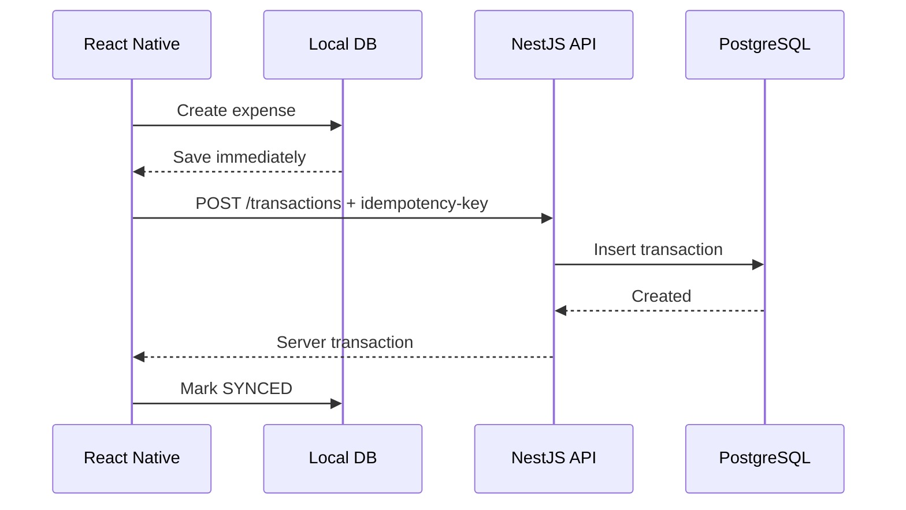
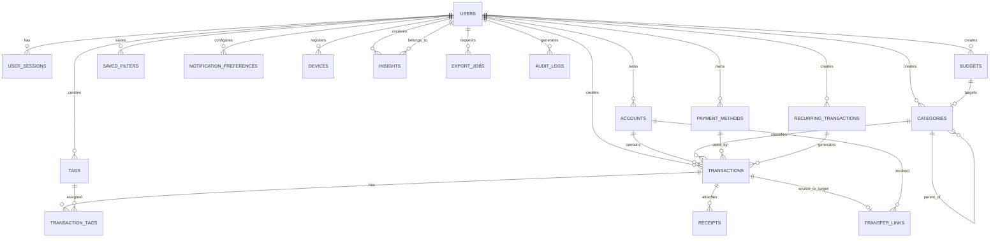
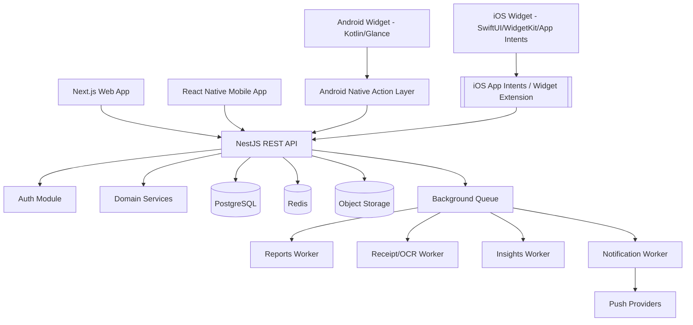
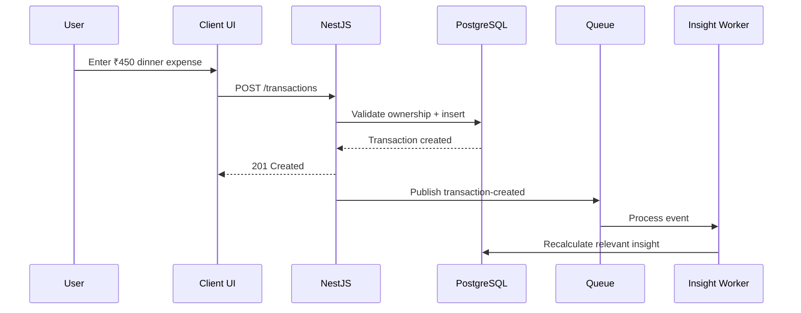
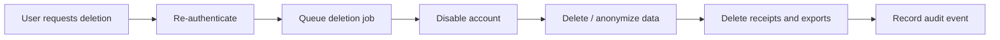
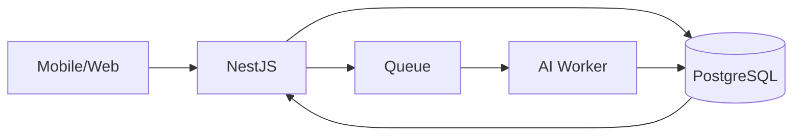

# Smart Expense Tracker — Product Requirements Document (PRD)

**Document status:** Ready for implementation
**Version:** 1.0
**Date:** 2026-09-06
**Project type:** Production-grade personal finance / expense tracking platform

---

## 1. Executive Summary

Smart Expense Tracker is a cross-platform personal finance application that helps users record income and expenses, organize transactions, set budgets, analyze spending, track recurring commitments, and receive actionable financial insights.

The platform consists of:

- **Web application:** Next.js + TypeScript
- **Backend API:** NestJS + TypeScript
- **Primary database:** PostgreSQL
- **Cache / transient state:** Redis
- **Mobile application:** React Native + TypeScript
- **Android widgets:** native Kotlin + Jetpack Glance
- **iOS widgets / controls:** native SwiftUI + WidgetKit + App Intents
- **Object storage:** S3-compatible storage for receipt images and exports
- **API contract:** REST + JSON as the primary external API
- **API documentation:** OpenAPI / Swagger
- **Optional internal serialization:** Protocol Buffers for selected internal services/events, not as the default public mobile API

The product should be designed as an **offline-tolerant, API-first system**. The mobile app can create transactions while offline and synchronize them when connectivity returns. Widgets should provide fast interaction and a compact view of financial status without forcing a user to navigate through the full application.

---

## 2. Product Vision

> Make tracking personal finances faster than spending money.

The application should reduce the friction of recording a transaction from several taps to a few seconds, while still providing enough analytical depth for users who want detailed financial insights.

The core UX principle is:

**Capture quickly → classify automatically → analyze effortlessly → act on insights.**

---

## 3. Goals

### Primary goals

1. Allow users to create an expense or income transaction in less than 10 seconds.
2. Provide a reliable searchable history of financial transactions.
3. Give users useful filtering and reporting tools.
4. Support category and budget management.
5. Support recurring income and expenses.
6. Provide actionable spending insights.
7. Support offline transaction creation on mobile.
8. Provide Android and iOS widgets for quick expense capture and financial summaries.
9. Keep the domain model extensible for future bank integrations, shared wallets, and AI-assisted categorization.

### Secondary goals

- Receipt capture and attachment.
- CSV/PDF export.
- Multiple accounts/wallets.
- Multiple currencies.
- Notification reminders.
- Shared household budgets in a later phase.

---

## 4. Non-Goals for MVP

The following should not block the first production release:

- Direct bank account aggregation.
- Investment portfolio management.
- Tax filing.
- Credit scoring.
- Real-money transfers.
- Lending/borrowing functionality.
- Full accounting / double-entry bookkeeping for businesses.
- Cryptocurrency portfolio tracking.

These can be added later as separate modules.

---

## 5. Target Users

### Persona A — Student

Needs:

- Quick expense entry.
- Food, travel, college and entertainment categories.
- Monthly spending limit.
- Simple charts.
- Mobile-first experience.

### Persona B — Salaried professional

Needs:

- Salary tracking.
- Rent, bills, subscriptions and recurring payments.
- Monthly budget planning.
- Expense trends.
- Payment-method analysis.

### Persona C — Household manager

Needs:

- Multiple wallets/accounts.
- Shared categories.
- Budget monitoring.
- Recurring obligations.
- Reports and exports.

---

# 6. Functional Scope

## 6.1 Authentication and Account

Users can:

- Register with email/password.
- Sign in.
- Sign out.
- Reset password.
- Verify email.
- Change password.
- Configure timezone.
- Configure default currency.
- Manage profile details.
- Manage active sessions/devices.
- Enable biometric app lock on supported mobile devices.

### Recommended authentication model

- Short-lived access token.
- Rotating refresh token.
- Refresh token stored securely on device using Keychain/Keystore.
- Password hashing using Argon2id.
- Email verification token.
- Password-reset token with short expiration.
- Device/session records in PostgreSQL.

---

## 6.2 Dashboard

The dashboard is the main financial overview.

### Dashboard widgets

1. **Current Balance**
2. **Income This Month**
3. **Expenses This Month**
4. **Budget Remaining**
5. **Savings Rate**
6. **Top Spending Categories**
7. **Recent Transactions**
8. **Upcoming Recurring Transactions**
9. **Budget Alerts**
10. **Smart Insights**

### Example

```text
Current Balance       ₹74,500
Income This Month     ₹95,000
Expenses This Month   ₹20,500
Budget Remaining      ₹24,500
Savings Rate          78.4%
```

---

## 6.3 Transactions

Every financial event is represented as a transaction.

### Transaction types

- `EXPENSE`
- `INCOME`
- `TRANSFER`
- `REFUND`
- `ADJUSTMENT`

### Core transaction fields

- Amount.
- Currency.
- Transaction date/time.
- Category.
- Account/wallet.
- Payment method.
- Merchant / title.
- Description.
- Notes.
- Tags.
- Receipt attachments.
- Recurring rule reference.
- Location (optional).
- Source (`MANUAL`, `WIDGET`, `IMPORT`, `RECURRING`, `API`).
- Sync status.

### Transaction states

- `PENDING_SYNC`
- `SYNCED`
- `FAILED`
- `VOIDED`

---

## 6.4 Quick Add Expense

Quick add must be available from:

- Mobile home screen.
- Floating action button.
- Android widget.
- iOS widget.
- App Shortcuts / Siri integration where supported.
- Deep link.

### Quick Add flow

1. User taps Quick Add.
2. Default transaction type is Expense.
3. User enters amount.
4. User selects category if not auto-selected.
5. Optional merchant/title.
6. Tap Save.
7. Transaction appears immediately.
8. Dashboard/widget cache is updated.
9. Background sync occurs if needed.

### Goal

A normal expense should be recorded in **2–5 interaction steps**.

---

# 7. Filters and Search

The filtering system should be one of the strongest parts of the product.

## 7.1 Mandatory filters

### Date range

Presets:

- Today
- Yesterday
- Last 7 days
- Last 30 days
- This week
- Last week
- This month
- Last month
- This quarter
- This year
- Custom range

### Transaction type

- All
- Income
- Expense
- Transfer
- Refund
- Adjustment

### Category

Single or multi-select category filtering.

### Account / Wallet

Examples:

- Cash
- HDFC Account
- SBI Account
- Wallet
- Credit Card

### Payment method

Examples:

- Cash
- UPI
- Debit Card
- Credit Card
- Bank Transfer
- Net Banking
- Wallet
- Other

### Amount range

- Minimum amount.
- Maximum amount.

### Search

Full-text-like search across:

- Transaction title.
- Merchant.
- Description.
- Notes.
- Tags.

### Sort

- Newest first.
- Oldest first.
- Highest amount.
- Lowest amount.
- Recently updated.

---

## 7.2 Advanced filters

These should be added after the core filter experience works.

- Recurring only.
- Has receipt.
- No receipt.
- Imported transactions.
- Widget-created transactions.
- Budget status.
- Merchant.
- Category group.
- Currency.
- Transaction status.
- Tagged transactions.

---

## 7.3 Saved Filters

Users can save commonly used filter combinations.

Examples:

- `Food This Month`
- `Subscriptions Last 90 Days`
- `Cash Expenses This Week`
- `Travel Expenses 2026`

Schema:

```text
saved_filters
    id
    user_id
    name
    filter_definition_json
    created_at
    updated_at
```

---

# 8. Categories

## Default expense categories

- Food & Dining
- Groceries
- Transport
- Fuel
- Shopping
- Entertainment
- Bills & Utilities
- Rent
- Healthcare
- Education
- Travel
- Personal Care
- Gifts
- Subscriptions
- Insurance
- Taxes
- Family
- Pets
- Other

## Default income categories

- Salary
- Freelance
- Business
- Interest
- Dividend
- Bonus
- Gift
- Refund
- Other Income

Users can create custom categories.

### Category hierarchy

Support optional parent-child relationships.

Example:

```text
Food & Dining
├── Restaurants
├── Fast Food
├── Coffee
└── Delivery
```

---

# 9. Budgets

Users should be able to define:

- Overall monthly budget.
- Category-level monthly budget.
- Weekly budget.
- Custom-period budget.

### Budget thresholds

Recommended threshold behavior:

- 0–79%: normal.
- 80–99%: warning.
- 100%+: exceeded.

### Budget calculations

```text
budget_used = sum(expenses for budget period/category)
budget_remaining = budget_limit - budget_used
usage_percent = budget_used / budget_limit * 100
```

Budgets should support:

- Start date.
- End date.
- Recurrence.
- Alert thresholds.
- Category.
- Account scope optionally.

---

# 10. Recurring Transactions

Recurring transactions represent expected future transactions.

Examples:

- Salary.
- Rent.
- Netflix.
- Electricity bill.
- Insurance.
- EMI.
- Subscription.

### Frequency

- Daily.
- Weekly.
- Monthly.
- Quarterly.
- Yearly.
- Custom interval.

### Rules

Support:

- Start date.
- End date.
- Next execution date.
- Amount.
- Category.
- Account.
- Payment method.
- Optional auto-create.

---

# 11. Accounts / Wallets

The product should not assume the user has only one balance.

Examples:

- Cash.
- Checking account.
- Savings account.
- Credit card.
- UPI wallet.
- Digital wallet.

### Account types

- `CASH`
- `BANK`
- `CREDIT_CARD`
- `WALLET`
- `INVESTMENT`
- `OTHER`

Each account should have its own balance and currency.

---

# 12. Transfers

Transfers move money between two accounts and should not count as income or expense.

Example:

```text
Savings Account → Cash
₹5,000
```

Internally this should create a linked transfer relationship rather than two unrelated expenses.

---

# 13. Payment Methods

Payment methods may be predefined or user-created.

Examples:

- Cash.
- UPI.
- Debit Card.
- Credit Card.
- Bank Transfer.
- Wallet.
- Other.

A payment method can optionally be linked to an account.

---

# 14. Tags

Tags allow cross-category organization.

Examples:

- Work.
- Personal.
- Trip.
- Family.
- Reimbursable.
- Office.
- College.

A transaction can have multiple tags.

---

# 15. Receipt Management

Users can attach receipt images or PDFs.

### Requirements

- Upload from camera.
- Upload from gallery.
- Multiple attachments per transaction.
- File size validation.
- MIME type validation.
- Secure object-storage URL.
- Thumbnail generation.
- Optional OCR in advanced phase.

### Future OCR feature

Receipt OCR may extract:

- Merchant.
- Total amount.
- Tax.
- Date.
- Items.

The extracted values must be presented as suggestions rather than silently overriding user data.

---

# 16. Reports and Analytics

## Monthly report

Show:

- Total income.
- Total expenses.
- Net savings.
- Savings rate.
- Category distribution.
- Daily spending trend.
- Payment method distribution.
- Account distribution.
- Budget utilization.

### Charts

Recommended charts:

1. Expense by category — doughnut chart.
2. Income vs expense — line chart.
3. Daily/weekly spending — bar chart.
4. Budget utilization — horizontal bars.
5. Account balances — cards / bars.

---

# 17. Smart Insights

The first implementation should use deterministic analytics rather than requiring an AI model.

### Examples

- “Food spending is 18% higher than last month.”
- “You spent the most on Travel this month.”
- “Your average daily expense increased from ₹620 to ₹780.”
- “You have used 92% of your Shopping budget.”
- “Subscriptions account for ₹2,349 this month.”

### Insight types

- Spending increase.
- Spending decrease.
- Category anomaly.
- Budget warning.
- Recurring charge increase.
- Savings improvement.
- Unusual transaction.

### Advanced AI phase

Potential AI features:

- Automatic category suggestion.
- Natural-language transaction entry.
- Receipt understanding.
- Spending explanations.
- Personalized budgeting suggestions.

Example:

```text
“Spent 450 on dinner with friends using UPI.”
```

The parser should suggest:

```json
{
  "amount": 450,
  "category": "Food & Dining",
  "paymentMethod": "UPI",
  "title": "Dinner",
  "tags": ["Friends"]
}
```

The user must confirm before final creation when NLP confidence is below the configured threshold.

---

# 18. Notifications

Notification categories:

- Budget 80% warning.
- Budget exceeded.
- Recurring transaction due.
- Monthly report ready.
- Weekly spending summary.
- Unusual spending detected.
- Sync failure.
- Export completed.

Notification preferences should be configurable per category.

---

# 19. Mobile React Native Application

## 19.1 Technology

- React Native.
- TypeScript.
- React Navigation or Expo Router depending on the chosen RN workflow.
- TanStack Query for server state.
- Zustand or Redux Toolkit for local application state.
- React Hook Form for forms.
- Zod for runtime validation.
- Secure storage using platform-native Keychain/Keystore integration.
- Local SQLite storage for offline transactions and cache.

## 19.2 Mobile navigation

Recommended tabs:

```text
Home
Transactions
Budgets
Reports
Settings
```

Floating Quick Add button should be accessible from the main tabs.

---

# 20. Mobile Screens

## Home

- Balance.
- Income.
- Expense.
- Budget progress.
- Spending chart.
- Recent transactions.
- Smart insight cards.

## Transactions

- Search.
- Filters.
- Group by date.
- Swipe actions.
- Pagination / infinite scroll.

## Add Transaction

Fields:

- Amount.
- Expense/income toggle.
- Category.
- Account.
- Payment method.
- Date.
- Merchant/title.
- Notes.
- Tags.
- Receipt.

## Budgets

- List budgets.
- Current usage.
- Remaining.
- Add budget.
- Edit budget.
- Alert settings.

## Reports

- Date range.
- Charts.
- Category breakdown.
- Export.

## Settings

- Currency.
- Timezone.
- Categories.
- Accounts.
- Payment methods.
- Notifications.
- Security.
- Data export.
- Account deletion.

---

# 21. Offline-First Mobile Strategy

Offline support is strongly recommended because expense capture is time-sensitive and should not fail simply because a user temporarily has no internet connection.

## Local persistence

Store locally:

- Pending transactions.
- Cached categories.
- Cached accounts.
- Cached recent transactions.
- User preferences.
- Sync cursor / version.

## Transaction sync model

Each local transaction should have:

```text
client_transaction_id
server_transaction_id
sync_status
local_updated_at
server_updated_at
```

Use an idempotency key when creating a transaction over the API.

### Sync lifecycle



### Conflict strategy

- Server is authoritative for committed records.
- Last-write-wins may be used for editable transaction metadata.
- Financial amounts should not be silently overwritten during conflict resolution.
- Conflicting edits should be detectable using `updated_at` / version numbers.

---

# 22. Android Widgets

## Objective

Provide an Android home-screen widget that lets the user:

1. View today's spending.
2. View this month's spending.
3. View remaining budget.
4. Quickly add an expense.
5. Launch the transaction screen.
6. Refresh widget data.

Android app widgets are hosted outside the main application UI. Jetpack Glance is the recommended Kotlin framework for building modern widgets. Glance provides Compose-style APIs and interaction actions; widget state should not rely on in-memory process state. citeturn546952search0turn546952search1turn546952search6

## 22.1 Recommended Android architecture

React Native remains the main application UI, but the Android widget should be implemented as a **native Kotlin widget module**.

Recommended layers:

```text
Android Widget
   ↓
Glance UI
   ↓
Kotlin Widget Action / Broadcast
   ↓
Shared local storage / secure token bridge
   ↓
API or app process
   ↓
NestJS API
```

## 22.2 Important design decision

Do **not** make the widget depend on the React Native JS runtime for basic interactions.

Reason:

- Widgets execute in a different runtime/process lifecycle.
- The operating system may wake them without the main React Native application being active.
- A native Kotlin implementation is more reliable for widget rendering and actions.

React Native can expose configuration or data synchronization hooks through native modules. React Native's current native-module architecture supports typed native integrations when a required platform API is not exposed directly. citeturn946081search3

## 22.3 Android widget sizes

Recommended widget variants:

### Small

```text
Today's spend
₹1,250

[ + Add ]
```

### Medium

```text
Today        This Month
₹1,250        ₹18,920

Budget left
₹11,080

[ + Expense ]
```

### Large

```text
March / current month summary

Expenses       Income        Savings
₹18,920        ₹75,000       ₹56,080

Top categories
Food       ₹4,200
Travel     ₹2,350
Bills      ₹3,800

[ + Expense ] [ Open App ]
```

## 22.4 Android quick-add flow

Preferred flow:

```text
Home screen widget
      ↓
Tap “+ Expense”
      ↓
Open lightweight Quick Add Activity
      ↓
Enter amount
      ↓
Select category
      ↓
Save
      ↓
Native layer writes/syncs
      ↓
Refresh widget
```

Android Glance supports click actions and custom `ActionCallback` implementations. Longer-running work should be moved to a background worker rather than performed inside the short interaction callback. citeturn546952search1turn546952search4

## 22.5 Android widget configuration

Allow the user to configure:

- Account to show.
- Currency.
- Budget to show.
- Widget theme if supported.
- Quick-add default category.

Android supports widget configuration activities and reconfiguration for placed widgets on supported OS versions. citeturn546952search3

---

# 23. iOS Widgets

## Objective

Provide iOS Home Screen widgets with:

- Today's expense.
- Monthly expense.
- Budget status.
- Quick Add Expense action.
- Optional account/category configuration.

Apple's WidgetKit supports widgets with SwiftUI and configurable timelines. Interactive widgets can expose buttons/toggles through App Intents, allowing actions without opening the main app. citeturn946081search0turn946081search5

## 23.1 Recommended iOS architecture

```text
React Native App
      │
      ├── iOS native module
      │
      └── Shared App Group storage
                │
        ┌───────┴────────┐
        ↓                ↓
   WidgetKit          App Intents
   SwiftUI            Quick Add Action
```

## 23.2 Shared data strategy

Use an iOS **App Group** shared container for small, non-sensitive widget display state.

Store only the minimum required widget data, such as:

```json
{
  "todayExpense": 1250,
  "monthExpense": 18920,
  "monthBudget": 30000,
  "currency": "INR",
  "lastUpdatedAt": "2026-09-06T18:00:00Z"
}
```

Do not store long-lived secrets in widget-visible shared storage.

The main React Native app should refresh this shared widget snapshot after successful sync. The widget should read this snapshot and render quickly.

## 23.3 Interactive iOS quick add

Recommended interaction:

```text
Widget
  ↓
Tap + Expense
  ↓
App Intent
  ↓
Quick-add action
  ↓
Persist transaction
  ↓
Refresh widget timeline
```

Apple documents that App Intents can expose app actions to widgets and other system experiences, and interactive widget actions can cause the widget timeline to reload after the action completes. citeturn946081search0turn946081search7

## 23.4 Configurable iOS widget

Allow parameters such as:

- Account.
- Category.
- Summary mode.
- Budget.

Use `WidgetConfigurationIntent` / `AppIntentConfiguration` for user-editable configuration. citeturn946081search8turn946081search9

---

# 24. Widget API Design

Widgets should not independently implement the complete application's business logic.

Recommended options:

### Option A — Shared local snapshot

Main application syncs data and stores a small local widget snapshot.

Advantages:

- Fast.
- Reliable.
- Reduces API calls.
- Better privacy.

### Option B — Widget directly calls backend

Not recommended as the default because it requires secure credential handling in native widget contexts and creates additional synchronization complexity.

### Recommended approach

Use **local snapshot for rendering + native action for quick add + backend sync through a controlled native/app path**.

---

# 25. Deep Links

Use deep links for actions that need full application UI.

Examples:

```text
expensetracker://home
expensetracker://transactions
expensetracker://transactions/new
expensetracker://transactions/123
expensetracker://budgets/food
expensetracker://reports?range=this-month
```

The widget should use deep links when the interaction needs the full React Native screen.

---

# 26. Web Application — Next.js

The web application should use Next.js with TypeScript. The current Next.js platform supports both App Router and Pages Router; this project should use the **App Router** for new development. citeturn946081search1

## Web stack

- Next.js.
- TypeScript.
- Tailwind CSS or another utility/design-system layer.
- React Hook Form.
- Zod.
- TanStack Query.
- Recharts / ECharts for analytics.
- Playwright for E2E.

## Web pages

```text
/
/login
/register
/forgot-password
/dashboard
/transactions
/transactions/new
/transactions/[id]
/budgets
/accounts
/categories
/recurring
/reports
/settings
/settings/profile
/settings/security
/settings/notifications
```

---

# 27. Backend — NestJS

NestJS should be organized by business domain rather than by technical layer alone.

## Recommended modules

```text
src/
├── auth/
├── users/
├── sessions/
├── accounts/
├── categories/
├── payment-methods/
├── transactions/
├── transfers/
├── budgets/
├── recurring-transactions/
├── tags/
├── receipts/
├── reports/
├── insights/
├── notifications/
├── exports/
├── sync/
├── audit/
├── health/
└── common/
```

NestJS controllers are responsible for receiving requests and routing them to application services; the framework also provides first-class OpenAPI/Swagger support for REST APIs. citeturn546952search5turn946081search4

---

# 28. REST vs GraphQL Decision

## Recommendation: REST for public/mobile/web API

Use **REST + JSON** as the primary API protocol.

### Why REST is the better default for this product

1. Financial resources have clear resource boundaries.
2. Mobile widgets and native integrations are simpler with standard HTTP endpoints.
3. REST is straightforward for caching, retries, observability, rate limits and debugging.
4. NestJS provides excellent REST and OpenAPI integration.
5. Swagger/OpenAPI can generate documentation and client contracts.
6. The API does not require highly dynamic nested querying in the MVP.
7. Offline synchronization maps naturally to explicit endpoints.

### Use GraphQL later if

- The dashboard becomes highly composable.
- Multiple frontends need significantly different projections.
- Client teams need flexible nested queries.
- A federated data layer becomes necessary.

NestJS supports both REST and GraphQL, including code-first and schema-first GraphQL approaches. citeturn546952search2

### Final protocol decision

```text
Public API: REST + JSON
API contract: OpenAPI
Internal async events: JSON initially
Optional high-throughput internal services: Protobuf
```

---

# 29. JSON vs Protocol Buffers

## Recommendation

Use **JSON for the public API**.

Use **Protocol Buffers only where it provides a measurable benefit**.

### REST request example

```http
POST /api/v1/transactions
Content-Type: application/json
Idempotency-Key: 6c8a9e...
Authorization: Bearer <token>
```

```json
{
  "clientTransactionId": "01J9...",
  "type": "EXPENSE",
  "amount": 450,
  "currency": "INR",
  "categoryId": "cat_123",
  "accountId": "acc_123",
  "paymentMethodId": "pm_123",
  "transactionAt": "2026-09-06T13:20:00+05:30",
  "title": "Dinner"
}
```

### Why not Protobuf for the public mobile API initially?

- JSON is easier to debug.
- Browser tooling is better.
- OpenAPI tooling is mature.
- Native widget integrations are simpler.
- The application's payload size is small enough that serialization overhead is unlikely to be a bottleneck.

### Where Protobuf can be valuable later

```text
NestJS API
   ↓
Event Bus / Internal Service
   ↓
Analytics / Notification / AI workers
```

For those internal boundaries, Protobuf + gRPC can be introduced if traffic or contract-management requirements justify it.

---

# 30. API Versioning

Use URL versioning:

```text
/api/v1/...
```

Future breaking changes use:

```text
/api/v2/...
```

Avoid breaking changes inside a stable version.

---

# 31. API Resource Design

## Authentication

```text
POST   /api/v1/auth/register
POST   /api/v1/auth/login
POST   /api/v1/auth/refresh
POST   /api/v1/auth/logout
POST   /api/v1/auth/forgot-password
POST   /api/v1/auth/reset-password
POST   /api/v1/auth/verify-email
```

## User

```text
GET    /api/v1/me
PATCH  /api/v1/me
DELETE /api/v1/me
```

## Transactions

```text
GET    /api/v1/transactions
POST   /api/v1/transactions
GET    /api/v1/transactions/:id
PATCH  /api/v1/transactions/:id
DELETE /api/v1/transactions/:id
POST   /api/v1/transactions/:id/restore
```

### Example transaction query

```text
GET /api/v1/transactions?
from=2026-09-01&
to=2026-09-30&
transactionType=EXPENSE&
categoryIds=food,travel&
accountIds=acc1,acc2&
paymentMethodIds=upi&
minAmount=100&
maxAmount=5000&
search=dinner&
sort=-transactionAt&page=1&pageSize=50
```

## Categories

```text
GET    /api/v1/categories
POST   /api/v1/categories
PATCH  /api/v1/categories/:id
DELETE /api/v1/categories/:id
```

## Accounts

```text
GET    /api/v1/accounts
POST   /api/v1/accounts
GET    /api/v1/accounts/:id
PATCH  /api/v1/accounts/:id
DELETE /api/v1/accounts/:id
```

## Payment methods

```text
GET    /api/v1/payment-methods
POST   /api/v1/payment-methods
PATCH  /api/v1/payment-methods/:id
DELETE /api/v1/payment-methods/:id
```

## Budgets

```text
GET    /api/v1/budgets
POST   /api/v1/budgets
GET    /api/v1/budgets/:id
PATCH  /api/v1/budgets/:id
DELETE /api/v1/budgets/:id
GET    /api/v1/budgets/:id/progress
```

## Recurring transactions

```text
GET    /api/v1/recurring-transactions
POST   /api/v1/recurring-transactions
PATCH  /api/v1/recurring-transactions/:id
DELETE /api/v1/recurring-transactions/:id
POST   /api/v1/recurring-transactions/:id/skip
```

## Reports

```text
GET /api/v1/reports/summary
GET /api/v1/reports/category-breakdown
GET /api/v1/reports/trend
GET /api/v1/reports/payment-methods
GET /api/v1/reports/accounts
GET /api/v1/reports/budget-performance
```

## Insights

```text
GET /api/v1/insights
POST /api/v1/insights/:id/dismiss
```

## Receipts

```text
POST   /api/v1/transactions/:id/receipts/presign
POST   /api/v1/transactions/:id/receipts/complete
GET    /api/v1/receipts/:id
DELETE /api/v1/receipts/:id
```

## Sync

```text
GET  /api/v1/sync/bootstrap
GET  /api/v1/sync/changes?cursor=...
POST /api/v1/sync/push
```

---

# 32. Standard API Response

Recommended response format:

```json
{
  "data": {},
  "meta": {
    "requestId": "req_123"
  }
}
```

Paginated response:

```json
{
  "data": [],
  "meta": {
    "page": 1,
    "pageSize": 50,
    "total": 420,
    "hasNext": true,
    "requestId": "req_123"
  }
}
```

Error format:

```json
{
  "error": {
    "code": "TRANSACTION_NOT_FOUND",
    "message": "Transaction was not found.",
    "details": {},
    "requestId": "req_123"
  }
}
```

---

# 33. PostgreSQL Database Design

## General conventions

- PostgreSQL.
- UUID primary keys for server entities.
- `timestamptz` for timestamps.
- `numeric(19,4)` for money amounts rather than floating-point.
- Foreign keys enforced in database.
- Soft deletion where recovery/audit is useful.
- `jsonb` only for flexible metadata, not core relational fields.
- UTC timestamps in storage.
- User timezone stored separately.

PostgreSQL provides `jsonb` indexing including GIN indexes, so JSON metadata can be queried efficiently when needed; however, core transaction fields should remain typed relational columns. citeturn946081search14

---

# 34. ER Diagram



---

# 35. Table Specifications

The following is the recommended initial production schema.

## 35.1 users

| Field | Type | Null | Default | Notes |
|---|---|---:|---|---|
| id | uuid | no | gen_random_uuid() | PK |
| email | varchar(320) | no | | unique |
| password_hash | text | no | | Argon2id hash |
| first_name | varchar(100) | yes | | |
| last_name | varchar(100) | yes | | |
| display_name | varchar(200) | yes | | |
| avatar_url | text | yes | | |
| default_currency | char(3) | no | 'INR' | ISO-4217 |
| timezone | varchar(100) | no | 'UTC' | IANA timezone |
| locale | varchar(20) | no | 'en-IN' | |
| email_verified_at | timestamptz | yes | | |
| status | varchar(20) | no | 'ACTIVE' | ACTIVE/SUSPENDED/DELETED |
| created_at | timestamptz | no | now() | |
| updated_at | timestamptz | no | now() | |
| deleted_at | timestamptz | yes | | soft delete |

Indexes:

```sql
CREATE UNIQUE INDEX ux_users_email_lower ON users (lower(email));
CREATE INDEX ix_users_status ON users(status);
```

---

## 35.2 user_sessions

| Field | Type | Notes |
|---|---|---|
| id | uuid | PK |
| user_id | uuid | FK users.id |
| refresh_token_hash | text | hashed rotating refresh token |
| device_id | uuid | FK devices.id, nullable |
| ip_address | inet | nullable |
| user_agent | text | nullable |
| expires_at | timestamptz | |
| revoked_at | timestamptz | nullable |
| created_at | timestamptz | |
| updated_at | timestamptz | |

---

## 35.3 devices

| Field | Type | Notes |
|---|---|---|
| id | uuid | PK |
| user_id | uuid | FK users.id |
| platform | varchar(20) | IOS/ANDROID/WEB |
| device_name | varchar(150) | |
| app_version | varchar(30) | |
| os_version | varchar(50) | |
| push_token | text | nullable |
| last_seen_at | timestamptz | |
| created_at | timestamptz | |
| updated_at | timestamptz | |

Index:

```sql
CREATE INDEX ix_devices_user_id ON devices(user_id);
```

---

## 35.4 accounts

Represents money containers / wallets.

| Field | Type | Notes |
|---|---|---|
| id | uuid | PK |
| user_id | uuid | FK users.id |
| name | varchar(150) | |
| account_type | varchar(30) | CASH/BANK/CREDIT_CARD/WALLET/INVESTMENT/OTHER |
| currency | char(3) | ISO-4217 |
| opening_balance | numeric(19,4) | |
| current_balance | numeric(19,4) | denormalized/cacheable |
| credit_limit | numeric(19,4) | nullable |
| color | varchar(20) | nullable |
| icon | varchar(100) | nullable |
| is_archived | boolean | default false |
| include_in_total | boolean | default true |
| created_at | timestamptz | |
| updated_at | timestamptz | |
| deleted_at | timestamptz | nullable |

Indexes:

```sql
CREATE INDEX ix_accounts_user_id ON accounts(user_id);
CREATE INDEX ix_accounts_user_active ON accounts(user_id, is_archived);
```

---

## 35.5 categories

| Field | Type | Notes |
|---|---|---|
| id | uuid | PK |
| user_id | uuid | nullable for system categories |
| parent_id | uuid | nullable self-FK |
| name | varchar(120) | |
| category_type | varchar(20) | EXPENSE/INCOME/BOTH |
| icon | varchar(100) | |
| color | varchar(20) | |
| is_system | boolean | default false |
| sort_order | integer | |
| is_active | boolean | default true |
| created_at | timestamptz | |
| updated_at | timestamptz | |
| deleted_at | timestamptz | nullable |

Constraints:

- User categories must belong to the same user.
- System categories can have `user_id = NULL`.

---

## 35.6 payment_methods

| Field | Type | Notes |
|---|---|---|
| id | uuid | PK |
| user_id | uuid | nullable for system methods |
| account_id | uuid | nullable FK accounts.id |
| name | varchar(100) | |
| method_type | varchar(30) | CASH/UPI/CARD/BANK_TRANSFER/WALLET/OTHER |
| is_system | boolean | |
| is_active | boolean | |
| created_at | timestamptz | |
| updated_at | timestamptz | |
| deleted_at | timestamptz | nullable |

---

## 35.7 transactions

This is the most important table.

| Field | Type | Notes |
|---|---|---|
| id | uuid | PK |
| user_id | uuid | FK users.id |
| client_transaction_id | uuid | client-generated idempotency identity |
| account_id | uuid | FK accounts.id |
| category_id | uuid | FK categories.id |
| payment_method_id | uuid | FK payment_methods.id, nullable |
| recurring_transaction_id | uuid | FK recurring_transactions.id, nullable |
| type | varchar(20) | EXPENSE/INCOME/TRANSFER/REFUND/ADJUSTMENT |
| amount | numeric(19,4) | positive magnitude |
| currency | char(3) | |
| title | varchar(200) | |
| merchant_name | varchar(200) | nullable |
| description | text | nullable |
| notes | text | nullable |
| transaction_at | timestamptz | |
| source | varchar(20) | MANUAL/WIDGET/IMPORT/RECURRING/API |
| status | varchar(20) | PENDING/SYNCED/FAILED/VOIDED |
| location_name | varchar(200) | nullable |
| latitude | numeric(9,6) | nullable |
| longitude | numeric(9,6) | nullable |
| external_reference | varchar(200) | nullable |
| metadata | jsonb | flexible metadata |
| version | bigint | optimistic concurrency |
| created_at | timestamptz | |
| updated_at | timestamptz | |
| deleted_at | timestamptz | nullable |

### Important constraints

```sql
CHECK (amount > 0);
UNIQUE (user_id, client_transaction_id);
```

### Important indexes

```sql
CREATE INDEX ix_transactions_user_date
ON transactions(user_id, transaction_at DESC);

CREATE INDEX ix_transactions_user_category_date
ON transactions(user_id, category_id, transaction_at DESC);

CREATE INDEX ix_transactions_user_account_date
ON transactions(user_id, account_id, transaction_at DESC);

CREATE INDEX ix_transactions_user_type_date
ON transactions(user_id, type, transaction_at DESC);

CREATE INDEX ix_transactions_merchant
ON transactions(user_id, merchant_name);
```

For very large installations, consider monthly partitioning by `transaction_at` after measuring real workload characteristics.

---

## 35.8 transaction_tags

| Field | Type |
|---|---|
| transaction_id | uuid FK |
| tag_id | uuid FK |
| created_at | timestamptz |

Primary key:

```text
(transaction_id, tag_id)
```

---

## 35.9 tags

| Field | Type | Notes |
|---|---|---|
| id | uuid | PK |
| user_id | uuid | FK |
| name | varchar(80) | |
| color | varchar(20) | nullable |
| created_at | timestamptz | |
| updated_at | timestamptz | |
| deleted_at | timestamptz | nullable |

Constraint:

```sql
UNIQUE(user_id, lower(name))
```

---

## 35.10 recurring_transactions

| Field | Type | Notes |
|---|---|---|
| id | uuid | PK |
| user_id | uuid | FK |
| account_id | uuid | FK |
| category_id | uuid | FK |
| payment_method_id | uuid | nullable FK |
| type | varchar(20) | EXPENSE/INCOME |
| amount | numeric(19,4) | |
| currency | char(3) | |
| title | varchar(200) | |
| description | text | nullable |
| frequency | varchar(30) | DAILY/WEEKLY/MONTHLY/QUARTERLY/YEARLY/CUSTOM |
| interval_value | integer | for CUSTOM |
| interval_unit | varchar(20) | DAY/WEEK/MONTH/YEAR |
| start_date | date | |
| end_date | date | nullable |
| next_run_at | timestamptz | |
| auto_create | boolean | |
| is_active | boolean | |
| metadata | jsonb | |
| created_at | timestamptz | |
| updated_at | timestamptz | |
| deleted_at | timestamptz | nullable |

---

## 35.11 budgets

| Field | Type | Notes |
|---|---|---|
| id | uuid | PK |
| user_id | uuid | FK |
| category_id | uuid | nullable; null means overall budget |
| account_id | uuid | nullable; optional account-scoped budget |
| name | varchar(150) | |
| amount | numeric(19,4) | budget limit |
| currency | char(3) | |
| period_type | varchar(20) | WEEKLY/MONTHLY/QUARTERLY/YEARLY/CUSTOM |
| start_date | date | |
| end_date | date | |
| rollover_enabled | boolean | |
| rollover_amount | numeric(19,4) | default 0 |
| warning_percent | numeric(5,2) | default 80 |
| critical_percent | numeric(5,2) | default 100 |
| is_active | boolean | |
| created_at | timestamptz | |
| updated_at | timestamptz | |
| deleted_at | timestamptz | nullable |

---

## 35.12 receipts

| Field | Type | Notes |
|---|---|---|
| id | uuid | PK |
| user_id | uuid | FK |
| transaction_id | uuid | FK |
| object_key | text | storage object path |
| original_filename | varchar(255) | |
| mime_type | varchar(100) | |
| file_size | bigint | bytes |
| checksum | varchar(128) | integrity |
| thumbnail_key | text | nullable |
| ocr_status | varchar(20) | NONE/PENDING/COMPLETED/FAILED |
| ocr_data | jsonb | nullable |
| created_at | timestamptz | |
| deleted_at | timestamptz | nullable |

---

## 35.13 transfer_links

| Field | Type | Notes |
|---|---|---|
| id | uuid | PK |
| user_id | uuid | FK |
| source_account_id | uuid | FK accounts |
| destination_account_id | uuid | FK accounts |
| source_transaction_id | uuid | FK transactions |
| destination_transaction_id | uuid | FK transactions |
| created_at | timestamptz | |

This table guarantees that the two transaction entries represent one logical transfer.

---

## 35.14 saved_filters

| Field | Type | Notes |
|---|---|---|
| id | uuid | PK |
| user_id | uuid | FK |
| name | varchar(120) | |
| filter_definition | jsonb | structured filter definition |
| created_at | timestamptz | |
| updated_at | timestamptz | |
| deleted_at | timestamptz | nullable |

Example:

```json
{
  "transactionType": ["EXPENSE"],
  "categoryIds": ["cat_food"],
  "datePreset": "THIS_MONTH",
  "minAmount": 100
}
```

---

## 35.15 notification_preferences

| Field | Type | Notes |
|---|---|---|
| id | uuid | PK |
| user_id | uuid | unique FK |
| budget_alerts | boolean | |
| recurring_alerts | boolean | |
| weekly_summary | boolean | |
| monthly_summary | boolean | |
| unusual_spending | boolean | |
| marketing | boolean | |
| push_enabled | boolean | |
| email_enabled | boolean | |
| updated_at | timestamptz | |

---

## 35.16 insights

| Field | Type | Notes |
|---|---|---|
| id | uuid | PK |
| user_id | uuid | FK |
| insight_type | varchar(50) | |
| title | varchar(200) | |
| description | text | |
| severity | varchar(20) | INFO/WARNING/CRITICAL |
| period_start | date | |
| period_end | date | |
| data | jsonb | calculation inputs/output |
| is_read | boolean | |
| is_dismissed | boolean | |
| created_at | timestamptz | |
| expires_at | timestamptz | nullable |

---

## 35.17 export_jobs

| Field | Type | Notes |
|---|---|---|
| id | uuid | PK |
| user_id | uuid | FK |
| export_type | varchar(20) | CSV/PDF/JSON |
| filters | jsonb | selected report scope |
| status | varchar(20) | QUEUED/PROCESSING/COMPLETED/FAILED |
| object_key | text | output location |
| error_message | text | nullable |
| requested_at | timestamptz | |
| completed_at | timestamptz | nullable |
| expires_at | timestamptz | nullable |

---

## 35.18 sync_cursors

| Field | Type | Notes |
|---|---|---|
| id | uuid | PK |
| user_id | uuid | FK |
| device_id | uuid | FK |
| cursor | bigint | monotonic sync position |
| last_synced_at | timestamptz | |
| created_at | timestamptz | |
| updated_at | timestamptz | |

---

## 35.19 audit_logs

| Field | Type | Notes |
|---|---|---|
| id | uuid | PK |
| user_id | uuid | nullable FK |
| actor_type | varchar(20) | USER/SYSTEM/ADMIN |
| action | varchar(100) | |
| entity_type | varchar(50) | |
| entity_id | uuid | nullable |
| before_data | jsonb | nullable |
| after_data | jsonb | nullable |
| ip_address | inet | nullable |
| user_agent | text | nullable |
| created_at | timestamptz | |

Audit logs should avoid storing sensitive authentication secrets.

---

# 36. Database Relationship Summary

```text
users
 ├── accounts
 ├── categories
 ├── payment_methods
 ├── transactions
 │    ├── receipts
 │    └── transaction_tags → tags
 ├── budgets
 ├── recurring_transactions
 │    └── transactions
 ├── saved_filters
 ├── insights
 ├── notification_preferences
 ├── devices
 │    └── user_sessions
 ├── export_jobs
 ├── sync_cursors
 └── audit_logs
```

---

# 37. Backend Layering

Use a clean application structure.

```text
Controller
   ↓
DTO / Validation
   ↓
Application Service
   ↓
Domain / Business Rules
   ↓
Repository
   ↓
PostgreSQL
```

Do not put significant business logic directly inside controllers.

---

# 38. NestJS Module Example

```text
transactions/
├── transactions.module.ts
├── transactions.controller.ts
├── transactions.service.ts
├── transactions.repository.ts
├── dto/
│   ├── create-transaction.dto.ts
│   ├── update-transaction.dto.ts
│   └── transaction-query.dto.ts
├── entities/
│   └── transaction.entity.ts
├── policies/
│   └── transaction.policy.ts
└── mappers/
    └── transaction.mapper.ts
```

Use DTO validation with `class-validator` or a standardized Zod-based validation strategy.

---

# 39. Caching Strategy

Redis can be used for:

- Rate-limit counters.
- Session-related transient data.
- Dashboard summaries where useful.
- Background-job coordination.
- Idempotency keys with expiration.
- Distributed locks.

Do not use Redis as the source of truth for financial transactions.

PostgreSQL remains the source of truth.

---

# 40. Background Jobs

Use a queue system such as BullMQ backed by Redis.

### Jobs

- Recurring transaction generation.
- Notification dispatch.
- Monthly report generation.
- CSV/PDF export.
- Receipt thumbnail processing.
- OCR.
- Insight generation.
- Cleanup / retention.
- Push notification fanout.

---

# 41. Transaction Creation Idempotency

Mobile widgets and mobile offline sync can retry requests.

Every create request should include:

```http
Idempotency-Key: <uuid>
```

Backend should store the key and final response for a limited retention period.

Example database table:

```text
idempotency_records
- id
- user_id
- idempotency_key
- request_hash
- response_status
- response_body
- created_at
- expires_at
```

Constraint:

```sql
UNIQUE(user_id, idempotency_key)
```

This prevents duplicate expenses caused by retries.

---

# 42. Security Requirements

## Authentication

- Argon2id password hashing.
- Short-lived access tokens.
- Rotating refresh tokens.
- Refresh token revocation.
- Email verification.
- Password reset.
- Device/session management.

## Authorization

Every resource query must scope by authenticated `user_id`.

Never trust a client-provided `user_id`.

### Example

Bad:

```sql
SELECT * FROM transactions WHERE id = :id;
```

Good:

```sql
SELECT *
FROM transactions
WHERE id = :id
  AND user_id = :authenticatedUserId;
```

## Input validation

Validate:

- Amount.
- UUIDs.
- Dates.
- Currency.
- Enum values.
- Text lengths.
- Uploaded files.

## Security headers

Use appropriate security middleware such as Helmet where supported.

## Rate limiting

Apply rate limits to:

- Login.
- Password reset.
- Registration.
- Receipt upload.
- Export creation.
- Public endpoints.

NestJS provides security-related integrations and documentation for common API protections such as rate limiting and authentication. citeturn946081search13

---

# 43. Privacy

Financial data is highly sensitive.

Requirements:

- Encrypt data in transit with TLS.
- Encrypt database/storage at rest.
- Do not log full financial payloads unnecessarily.
- Never log passwords or access/refresh tokens.
- Avoid storing raw payment-card numbers.
- Use signed URLs for private receipt files.
- Support account deletion.
- Support data export.
- Define retention policy.

---

# 44. API Rate Limits

Recommended initial limits:

| Endpoint type | Suggested limit |
|---|---:|
| Login | 5/min/IP |
| Password reset | 5/hour/account |
| Normal API | 120/min/user |
| Transaction creation | 60/min/user |
| Export creation | 5/hour/user |
| Receipt upload | 30/min/user |

These values should be configurable rather than hardcoded.

---

# 45. Observability

## Logging

Structured JSON logs containing:

- Timestamp.
- Level.
- Request ID.
- User ID when appropriate.
- Route.
- Status.
- Duration.
- Error code.

Never log:

- Passwords.
- Access tokens.
- Refresh tokens.
- Full receipt contents.
- Sensitive financial data unless required for debugging and appropriately redacted.

## Metrics

Track:

- API request latency.
- Error rate.
- Transaction creation success rate.
- Sync failures.
- Queue backlog.
- Database latency.
- Cache hit rate.
- Widget action failures.
- Receipt processing failures.

## Tracing

OpenTelemetry is recommended for distributed tracing as the architecture grows.

---

# 46. Performance Requirements

## API

Target:

- P50 < 150 ms for typical CRUD API calls.
- P95 < 500 ms for typical API calls under normal load.
- Report endpoints may be slower if complex.

## Mobile

- Quick Add UI should render instantly from local state.
- Offline save should not block on network.
- Widget UI should load from a compact snapshot.

## Database

Transactions are the largest table and should receive most indexing attention.

Do not create indexes for every possible filter combination without measurement.

---

# 47. Pagination Strategy

Use cursor-based pagination for mobile transaction feeds at scale.

Example:

```text
GET /transactions?limit=50&cursor=eyJ0cmFuc2FjdGlvbkF0Ijoi..."
```

Offset pagination can still be used for web admin-like reports and moderate datasets.

Recommended default:

- Mobile transaction feed → cursor.
- Web filter results → cursor or offset depending on UI.
- Reports → aggregate endpoint, not transaction pagination.

---

# 48. Search Strategy

MVP:

- PostgreSQL indexes.
- Prefix/ILIKE search for merchant/title.

Advanced:

- PostgreSQL full-text search or trigram indexes.
- Dedicated search engine only if scale justifies it.

Example later optimization:

```sql
CREATE EXTENSION IF NOT EXISTS pg_trgm;

CREATE INDEX ix_transactions_merchant_trgm
ON transactions USING gin (merchant_name gin_trgm_ops);
```

---

# 49. Money Handling Rules

Never store money as JavaScript floating-point numbers for persisted financial calculations.

### Correct

```text
PostgreSQL NUMERIC(19,4)
```

At the API boundary use either:

- decimal strings, or
- integer minor units when all currencies in scope are modeled appropriately.

For example:

```json
{
  "amount": "1250.50",
  "currency": "INR"
}
```

This avoids floating-point rounding errors.

---

# 50. Currency Strategy

MVP can be single-default-currency per user while supporting currency per transaction/account in the database.

Store:

```text
users.default_currency
accounts.currency
transactions.currency
budgets.currency
```

Do not rely on a global application currency.

Future multi-currency support should introduce:

```text
exchange_rates
currency_conversions
```

---

# 51. API Contract Example — Create Transaction

```http
POST /api/v1/transactions
Authorization: Bearer <access-token>
Content-Type: application/json
Idempotency-Key: 6f0d6fd3-8be1-4cc9-a64e-xxxx
```

```json
{
  "clientTransactionId": "af4b9d1a-c4ef-4d4d-9d9d-xxxx",
  "type": "EXPENSE",
  "amount": "450.00",
  "currency": "INR",
  "accountId": "f1d6...",
  "categoryId": "c7d9...",
  "paymentMethodId": "p1a2...",
  "title": "Dinner",
  "merchantName": "Example Restaurant",
  "notes": "Dinner with friends",
  "transactionAt": "2026-09-06T18:30:00+05:30",
  "source": "MOBILE"
}
```

Response:

```json
{
  "data": {
    "id": "8d7b...",
    "type": "EXPENSE",
    "amount": "450.00",
    "currency": "INR",
    "status": "SYNCED",
    "createdAt": "2026-09-06T13:00:02Z"
  },
  "meta": {
    "requestId": "req_789"
  }
}
```

---

# 52. API Query Example — Transaction Filters

```http
GET /api/v1/transactions
    ?from=2026-09-01
    &to=2026-09-30
    &types=EXPENSE
    &categoryIds=food,travel
    &accountIds=bank,cash
    &paymentMethodIds=upi
    &minAmount=100
    &maxAmount=10000
    &hasReceipt=true
    &search=dinner
    &sort=-transactionAt
    &cursor=...
```

Backend should translate the validated query DTO into parameterized SQL.

Do not concatenate raw query strings into SQL.

---

# 53. Reporting API Example

## Summary

```http
GET /api/v1/reports/summary?from=2026-09-01&to=2026-09-30
```

```json
{
  "data": {
    "income": "95000.00",
    "expenses": "20500.00",
    "netSavings": "74500.00",
    "savingsRate": 78.42,
    "transactionCount": 84
  }
}
```

## Category breakdown

```json
{
  "data": [
    {
      "categoryId": "food",
      "categoryName": "Food & Dining",
      "amount": "6200.00",
      "percentage": 30.24
    }
  ]
}
```

---

# 54. Architecture Diagram



---

# 55. Transaction Creation Sequence



---

# 56. Budget Calculation Architecture

Budget status can be computed dynamically for MVP.

```text
Budget limit
    ↓
Transactions in date range
    ↓
Filter user/account/category
    ↓
SUM expense amounts
    ↓
Used amount
    ↓
Percentage
    ↓
Budget status
```

For high scale, materialized daily/monthly aggregates may be introduced.

Do not prematurely denormalize every dashboard metric.

---

# 57. Analytics Aggregation Tables — Future Scale

If transaction volume grows substantially, introduce summary tables.

Example:

```text
daily_category_summaries
- id
- user_id
- date
- category_id
- account_id
- currency
- expense_amount
- income_amount
- transaction_count
- created_at
- updated_at
```

This can accelerate monthly reports without making the transaction table responsible for every dashboard query.

---

# 58. Frontend State Management

Separate state into three categories.

### Server state

Use TanStack Query:

- Transactions.
- Categories.
- Budgets.
- Reports.
- Insights.

### UI state

Use Zustand or local React state:

- Current modal.
- Selected date range.
- Open filters.
- Widget display preferences.

### Offline/domain state

Use SQLite/local database:

- Pending transactions.
- Cached reference data.
- Sync queue.

Do not put the complete transaction dataset into an unstructured global state store.

---

# 59. Frontend Design System

Use a consistent design system across web and mobile where possible.

### Core components

- Button.
- Input.
- Currency Input.
- Date Picker.
- Category Picker.
- Account Picker.
- Payment Method Picker.
- Transaction Row.
- Budget Progress.
- Metric Card.
- Chart Card.
- Filter Sheet.
- Bottom Sheet.
- Confirmation Dialog.
- Empty State.
- Skeleton Loader.
- Error State.

### Mobile UX

Prefer bottom sheets for quick selection instead of full navigation wherever appropriate.

---

# 60. Important UX Rules

1. Amount entry must be optimized for numeric keypad usage.
2. Category selection should remember recent categories.
3. Recent merchants should be suggested.
4. Last used account/payment method can be suggested.
5. The Save action must be prominent.
6. Avoid forcing users to fill optional fields.
7. Keep receipt capture optional.
8. Allow undo after deleting a transaction.
9. Show clear sync status when offline.
10. Never silently discard a transaction.

---

# 61. Smart Quick Add Improvements

Over time, Quick Add should become predictive.

Example:

```text
User often records:
“Coffee” → Food → UPI → HDFC

Next time the app suggests:

Coffee
Amount: ____
Category: Food
Payment: UPI
Account: HDFC
```

The user can save with minimal interaction.

---

# 62. Widget Product Requirements

## Widget A — Quick Expense

The widget should primarily optimize transaction capture.

```text
+----------------------+
|  Add Expense         |
|                      |
|       ₹ 450          |
|                      |
| [ Food ] [ Travel ]  |
|                      |
|      SAVE            |
+----------------------+
```

## Widget B — Financial Snapshot

```text
+----------------------+
| TODAY       MONTH    |
| ₹1,250     ₹18,920   |
|                      |
| Budget left ₹11,080  |
|                      |
| + Expense     Open   |
+----------------------+
```

## Widget C — Budget Watch

```text
Food Budget
₹6,800 / ₹8,000
85%

[Add Expense]
```

---

# 63. iOS and Android Widget Constraints

The widget should be treated as a lightweight companion surface, not as the full application.

### Widget should handle

- Displaying a snapshot.
- Simple actions.
- Quick add.
- Opening the app to a specific screen.
- Widget configuration.

### Widget should not handle

- Large transaction lists.
- Heavy report generation.
- Long network operations.
- Sensitive credential management.
- Complex multi-step workflows.

Apple widgets are rendered through WidgetKit timelines and run in an environment separate from the main application UI; App Intents are the mechanism for interactive actions. citeturn946081search0

Android widgets similarly operate outside the main application UI lifecycle, and Glance documentation explicitly recommends keeping widget state appropriately scoped rather than relying on in-memory app state. citeturn546952search6

---

# 64. Widget Data Refresh Strategy

## Main application

After transaction synchronization:

```text
Update local cache
      ↓
Update widget snapshot
      ↓
Request widget reload/update
```

## Background refresh

Use OS-supported refresh mechanisms conservatively.

Do not continuously poll the backend from widgets.

## Refresh triggers

- Transaction created.
- Transaction edited.
- Transaction deleted.
- Budget updated.
- App foregrounded.
- Scheduled OS refresh.

---

# 65. Notification / Widget Integration

When budget status changes significantly:

```text
Transaction created
      ↓
Budget recalculated
      ↓
Cross threshold?
      ├── No → nothing
      └── Yes → notification + widget refresh
```

---

# 66. Testing Strategy

## Unit testing

Backend:

- Services.
- Policies.
- Budget calculations.
- Currency calculations.
- Recurring rules.
- Insight calculations.

Frontend:

- Form validation.
- Filter serialization.
- Offline queue behavior.

## Integration testing

- API + PostgreSQL.
- Authentication.
- Transactions.
- Budgets.
- Recurring transactions.
- Sync.

## E2E testing

Use Playwright for web.

For React Native, use an appropriate mobile E2E solution such as Detox or platform-native instrumentation depending on the final workflow.

## Widget testing

Android:

- Widget rendering.
- Action callback.
- Configuration.
- State restoration.

iOS:

- Timeline rendering.
- App Intent execution.
- Widget configuration.
- Deep links.

---

# 67. Critical Test Cases

### Transaction

- Create expense.
- Create income.
- Edit expense.
- Delete expense.
- Restore expense.
- Duplicate API request with same idempotency key.
- Offline transaction then sync.
- Two devices editing same transaction.

### Budget

- Exactly 80% usage.
- Exactly 100% usage.
- Above 100%.
- Refund impacts usage correctly.
- Transfer does not affect expense budget.

### Accounts

- Income increases balance.
- Expense decreases balance.
- Transfer moves balance between accounts.
- Deleted account does not break historical transactions.

### Widget

- User not logged in.
- Token expired.
- Offline mode.
- Quick add succeeds.
- Quick add fails.
- Widget shows stale data.
- Multiple widgets with different configurations.

---

# 68. Error Handling

Use stable application error codes.

Examples:

```text
AUTH_INVALID_CREDENTIALS
AUTH_SESSION_EXPIRED
VALIDATION_FAILED
RESOURCE_NOT_FOUND
TRANSACTION_DUPLICATE
TRANSACTION_CONFLICT
BUDGET_NOT_FOUND
ACCOUNT_ARCHIVED
FILE_TOO_LARGE
FILE_TYPE_NOT_ALLOWED
SYNC_CONFLICT
RATE_LIMITED
INTERNAL_ERROR
```

Clients should branch behavior on error code, not fragile human-readable messages.

---

# 69. Data Deletion Strategy

Support:

- Soft delete for normal user actions.
- Permanent deletion for account closure after defined retention period.

Account deletion workflow:



The exact retention period should be chosen according to legal/privacy requirements for the target market.

---

# 70. Deployment Architecture

Recommended production setup:

```text
                    Internet
                       |
                  Load Balancer
                       |
          +------------+------------+
          |                         |
       Next.js                  NestJS API
          |                         |
          |              +----------+----------+
          |              |                     |
          |          PostgreSQL              Redis
          |                                    |
          |                                  Queue
          |                                    |
          |                    +---------------+---------------+
          |                    |               |               |
          |                 Reports          OCR           Notifications
          |
       Object Storage (receipts/exports)
```

For an initial deployment, the infrastructure can be significantly simpler; keep the architecture conceptually ready for horizontal scaling.

---

# 71. Recommended Repository Structure

A monorepo is recommended.

```text
expense-tracker/
├── apps/
│   ├── web/                 # Next.js
│   ├── api/                 # NestJS
│   └── mobile/              # React Native
├── packages/
│   ├── api-contracts/
│   ├── validation/
│   ├── types/
│   ├── config/
│   ├── eslint-config/
│   └── tsconfig/
├── infrastructure/
│   ├── docker/
│   ├── terraform/
│   └── k8s/                 # optional later
├── docs/
│   ├── api/
│   ├── architecture/
│   └── product/
└── package.json
```

Use pnpm workspaces or another monorepo tool such as Turborepo.

---

# 72. Shared Contract Strategy

Share TypeScript types where it genuinely reduces duplication, but do not couple every client directly to backend implementation classes.

Recommended:

```text
OpenAPI schema
      ↓
Generated API types/client
      ↓
Web + React Native
```

Domain classes should remain inside the API application.

---

# 73. API Documentation

NestJS should generate OpenAPI documentation.

Required:

- Endpoint descriptions.
- Request DTOs.
- Response DTOs.
- Error schemas.
- Authentication security scheme.
- Query parameters.
- Examples.

The NestJS OpenAPI module is specifically designed to generate an API specification for REST endpoints. citeturn946081search4

---

# 74. MVP Scope

The first production milestone should include:

### Must Have

- Authentication.
- User profile.
- Accounts.
- Categories.
- Payment methods.
- Add/edit/delete transactions.
- Transaction search and filters.
- Dashboard.
- Monthly budget.
- Category budgets.
- Basic reports.
- Recurring transactions.
- Offline mobile transaction creation.
- REST API + OpenAPI.
- Android widget.
- iOS widget.

### Should Have

- Receipt uploads.
- CSV export.
- Push notifications.
- Saved filters.
- Smart deterministic insights.

### Could Have

- Receipt OCR.
- Natural-language quick add.
- AI categorization.
- Shared budgets.
- Multi-currency conversion.
- Bank integrations.

---

# 75. Advanced Feature Roadmap

## Phase 2 — Intelligence

- AI category suggestions.
- Receipt OCR.
- Natural-language transaction creation.
- Spending anomaly detection.
- Personalized budget recommendations.

## Phase 3 — Financial Connectivity

- Bank data aggregation.
- Automatic transaction import.
- Merchant normalization.
- Duplicate transaction detection.

## Phase 4 — Collaboration

- Shared wallets.
- Household members.
- Shared budgets.
- Approval workflows.
- Reimbursement tracking.

## Phase 5 — Advanced Finance

- Multi-currency.
- Investments.
- Net-worth dashboard.
- Debt tracking.
- Financial goals.

---

# 76. Financial Goals

A future goal system should allow:

```text
Goal: Emergency Fund
Target: ₹300,000
Current: ₹120,000
Target Date: 2027-12-31
```

Potential goal types:

- Emergency fund.
- Vacation.
- New phone.
- Car.
- Education.

---

# 77. Expense Splitting — Future

A future transaction can support splitting one amount across categories.

Example:

```text
₹2,000 restaurant bill
├── Food: ₹1,500
└── Entertainment: ₹500
```

This requires a future `transaction_splits` table.

---

# 78. Reimbursement Tracking — Future

Useful for work expenses.

Fields could include:

```text
reimbursement_status
reimbursement_claim_id
reimbursable_amount
reimbursed_at
```

Statuses:

- NOT_REIMBURSABLE
- PENDING
- SUBMITTED
- APPROVED
- REIMBURSED
- REJECTED

---

# 79. Duplicate Detection — Advanced

Detect potentially duplicated transactions using:

- Same amount.
- Same account.
- Same merchant.
- Close timestamps.
- Same category.

Example confidence score:

```text
0.92 — likely duplicate
```

Do not automatically delete; show a review action.

---

# 80. Merchant Normalization — Advanced

Normalize merchant names:

```text
AMZN MKTPLACE PMTS
Amazon Marketplace
AMAZON.IN
```

into:

```text
Amazon
```

This improves analytics.

A future `merchants` table can be introduced:

```text
merchants
- id
- canonical_name
- logo_url
- category_hint
- aliases
- metadata
```

---

# 81. AI Architecture — Future

Do not put AI directly into the synchronous transaction creation API initially.

Recommended:



AI tasks:

- Categorization suggestion.
- Merchant normalization.
- Receipt parsing.
- Natural-language parsing.
- Insight generation.

The financial database remains the source of truth.

---

# 82. Event-Driven Architecture — Future

Events can be published for important state changes.

Examples:

```text
transaction.created
transaction.updated
transaction.deleted
budget.threshold_reached
recurring_transaction.due
receipt.processed
user.created
```

Initially JSON events can be sufficient.

Introduce Protobuf only if internal service contracts or throughput justify it.

---

# 83. Recommended API Event Payload

```json
{
  "eventId": "evt_123",
  "eventType": "transaction.created",
  "occurredAt": "2026-09-06T13:30:00Z",
  "userId": "usr_123",
  "entityId": "txn_123",
  "data": {
    "amount": "450.00",
    "currency": "INR",
    "categoryId": "cat_food"
  }
}
```

---

# 84. Acceptance Criteria — Core Transaction

A transaction feature is accepted when:

- User can create expense.
- User can create income.
- User can edit transaction.
- User can delete transaction.
- User can restore where supported.
- Amount is stored accurately.
- Transaction belongs only to the authenticated user.
- Duplicate idempotent requests do not create duplicate transactions.
- Mobile can create transaction offline.
- Widget can initiate quick add.
- Reports include the transaction correctly.
- Budget calculations include/exclude it correctly.

---

# 85. Acceptance Criteria — Filters

The transaction screen is accepted when users can combine:

```text
Date + Category + Account + Payment Method + Amount + Search
```

and receive correct results.

The same filter definition must be serializable so it can later power:

- Saved filters.
- Export filters.
- Reports.
- Deep links.

---

# 86. Acceptance Criteria — Widgets

### Android

- User can place widget on home screen.
- Widget shows current financial snapshot.
- User can tap Quick Add.
- Quick Add can save a transaction.
- Widget refreshes after save.
- Widget handles offline/failure states gracefully.
- Widget can be configured.

### iOS

- User can place widget on Home Screen.
- Widget shows current financial snapshot.
- Interactive Quick Add action is available where supported by target OS capabilities.
- Configuration supports account/budget selection.
- Timeline refresh is triggered after interaction.
- Widget does not expose secrets.

Apple's current WidgetKit model supports interactive buttons/toggles using App Intents and configurable widgets through App Intent configuration. citeturn946081search0turn946081search8

---

# 87. Definition of Done

A feature is complete when:

- Backend endpoint exists.
- DTO validation exists.
- Authorization is enforced.
- Database migration exists.
- Unit tests exist.
- Integration tests exist where appropriate.
- OpenAPI documentation is updated.
- Web UI is implemented.
- Mobile UI is implemented where in scope.
- Offline behavior is defined.
- Analytics/event tracking is defined where appropriate.
- Error states are implemented.
- Loading states are implemented.
- Empty states are implemented.
- Accessibility considerations are handled.

---

# 88. Recommended Initial Sprint Breakdown

## Sprint 1 — Foundation

- Monorepo setup.
- Next.js app.
- NestJS app.
- React Native app.
- PostgreSQL.
- Redis.
- Docker development environment.
- Authentication.
- User/session tables.
- CI pipeline.

## Sprint 2 — Financial Core

- Accounts.
- Categories.
- Payment methods.
- Transactions.
- CRUD APIs.
- Dashboard basics.

## Sprint 3 — Filters + Budgets

- Search.
- Advanced filters.
- Saved filters.
- Budget creation.
- Budget progress.
- Alerts.

## Sprint 4 — Mobile + Offline

- Mobile transaction flow.
- Local DB.
- Sync queue.
- Idempotency.
- Conflict handling.

## Sprint 5 — Widgets

- Android Glance widget.
- Android quick add.
- iOS WidgetKit extension.
- iOS App Intent.
- Shared widget snapshots.
- Deep links.

## Sprint 6 — Reports + Advanced Features

- Reports.
- Smart insights.
- Recurring transactions.
- Receipt upload.
- Export.
- Notifications.

---

# 89. Final Architecture Decision Summary

| Area | Decision |
|---|---|
| Web | Next.js + TypeScript |
| Backend | NestJS + TypeScript |
| Database | PostgreSQL |
| Cache | Redis |
| Queue | BullMQ/Redis |
| Mobile | React Native + TypeScript |
| Android Widget | Kotlin + Jetpack Glance |
| iOS Widget | SwiftUI + WidgetKit |
| iOS Actions | App Intents |
| Public API | REST |
| API Payload | JSON |
| API Contract | OpenAPI |
| Internal RPC (future) | gRPC + Protobuf when justified |
| Auth | Access + rotating refresh tokens |
| Password hashing | Argon2id |
| Offline DB | SQLite |
| Object storage | S3-compatible |
| Charts | Recharts/ECharts + RN chart library |
| Testing | Jest + Playwright + mobile E2E |
| Observability | Structured logs + metrics + OpenTelemetry later |
| Deployment | Docker-first, cloud-ready |

---

# 90. Most Important Engineering Principles

1. **PostgreSQL is the source of truth for financial data.**
2. **Never use floating-point arithmetic for persisted money values.**
3. **Every transaction create operation should be idempotent.**
4. **Mobile quick add must work offline.**
5. **Widgets should use native platform implementations, not depend entirely on React Native JS runtime.**
6. **Keep widget data minimal and privacy-safe.**
7. **REST + JSON is the right default public API for this product.**
8. **Use Protobuf only when an internal boundary actually benefits from it.**
9. **Every database query involving user data must enforce user ownership.**
10. **Filters should be composable and reusable across transactions, saved filters, exports, and reports.**
11. **Start with deterministic financial insights before adding AI.**
12. **Add complexity only when usage or scale proves it is necessary.**

---

# 91. Implementation References

The following official documentation was used to validate current platform/API capabilities:

- Next.js documentation: https://nextjs.org/docs
- NestJS OpenAPI documentation: https://docs.nestjs.com/openapi
- NestJS controllers: https://docs.nestjs.com/controllers
- NestJS GraphQL: https://docs.nestjs.com/graphql/quick-start
- React Native native modules: https://reactnative.dev/docs/turbo-native-modules-introduction
- Android Jetpack Glance: https://developer.android.com/develop/ui/compose/glance
- Android Glance interactions: https://developer.android.com/develop/ui/compose/glance/user-interaction
- Android widget configuration: https://developer.android.com/develop/ui/compose/glance/configuration
- Apple WidgetKit interactivity/App Intents: https://developer.apple.com/documentation/widgetkit/adding-interactivity-to-widgets-and-live-activities
- Apple App Intents: https://developer.apple.com/documentation/appintents
- Apple configurable widgets: https://developer.apple.com/documentation/widgetkit/making-a-configurable-widget
- PostgreSQL JSON/JSONB documentation: https://www.postgresql.org/docs/current/datatype-json.html

---

# 92. Final Recommendation

Build the first version as a **modular monolith** rather than jumping directly to microservices.

Recommended architecture:

```text
Next.js
   ↓
NestJS Modular Monolith
   ↓
PostgreSQL + Redis
   ↓
Background Workers
```

Keep these modules independently testable and domain-focused. Only split services later when there is a real operational reason.

For mobile, use React Native for the main application and native Kotlin/Swift extensions for widgets. That gives the project a shared cross-platform application layer without fighting the operating systems' native widget execution models. React Native explicitly supports native-module integration for platform capabilities that are not directly exposed to JavaScript. citeturn946081search3

The best first implementation target is:

```text
Authentication
+ Accounts
+ Categories
+ Transactions
+ Filters
+ Budgets
+ Reports
+ Offline Mobile
+ Android Widget
+ iOS Widget
+ Recurring Transactions
```

Once those are stable, add receipts, deterministic insights, OCR, AI categorization, natural-language quick add, and bank integrations.

